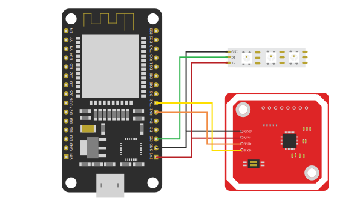

# Arduino / ESP32 Module

The [Vinyl Player](../) ESP32 is the hardware that is embedded inside the wooden shelf. It is responsible for detecting the vinyl NFC tags and communicating with the server about the newly read vinyls.

## Schematics

The ESP32 (on the left) communicates with the sensor (on the right) using RX-TX communication. On the ESP32 the pins RX2 and TX2 are connected to TX and RX pins of the sensor.

The LED strip is connected to datapin 15 (can be another digital pin if defined in the code).

## Build & Run

We use [platform.io](https://platformio.org/) with VSCode to deploy our code to the ESP32.

## Configuration

You need to copy the file [`include/secrets.example.h`](./include/secrets.example.h) to `include/secrets.h` and fill it with the correct Wi-Fi credentials, as well as the URL of the server endpoint.
